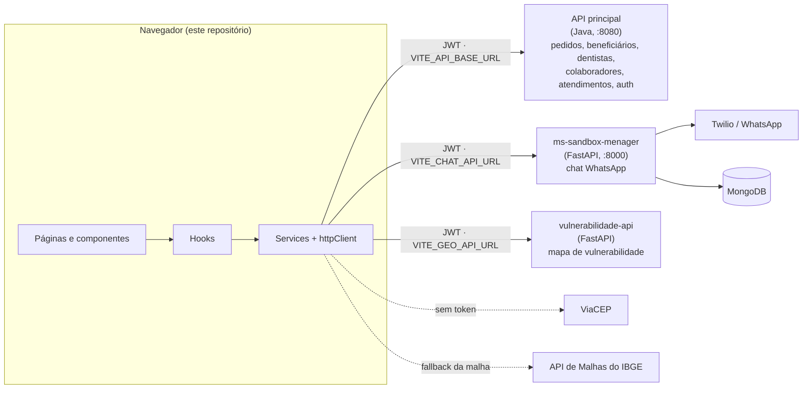
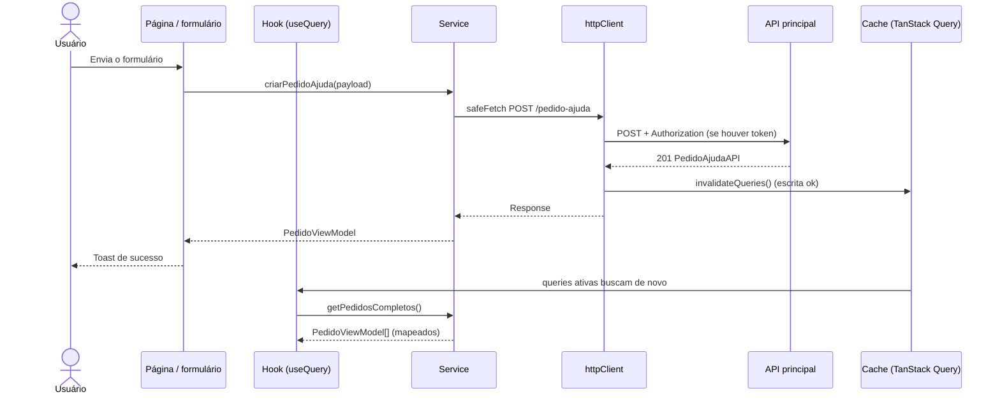
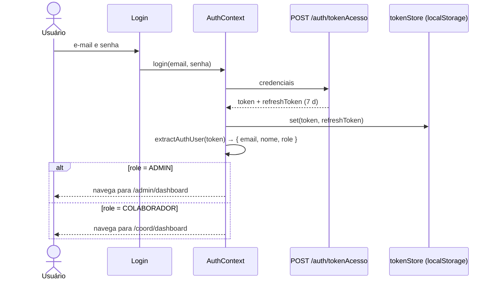
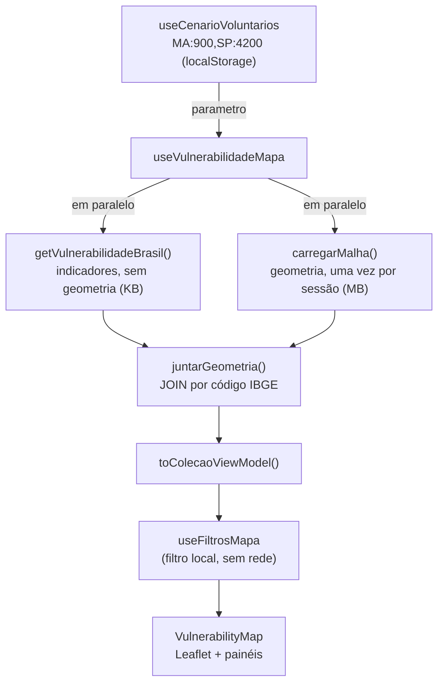

# Arquitetura — Raiz do Bem

Guia do front-end (SPA em React). Para instalar e rodar, veja o [README](README.md).

## Sumário

1. [Visão geral](#visão-geral)
2. [Camadas de código](#camadas-de-código)
3. [Fluxo de dados](#fluxo-de-dados)
4. [Estado e cache](#estado-e-cache)
5. [Autenticação e rotas](#autenticação-e-rotas)
6. [Serviços externos](#serviços-externos)
7. [Mapa de vulnerabilidade](#mapa-de-vulnerabilidade)
8. [Testes](#testes)
9. [Como adicionar uma funcionalidade](#como-adicionar-uma-funcionalidade)

---

## Visão geral

Aplicação de página única (SPA) construída com **React 19 + TypeScript + Vite**, estilizada com **Tailwind CSS 4** e publicada na **Vercel** (todas as rotas reescritas para `index.html`, ver [`vercel.json`](vercel.json)). Sem servidor próprio: o navegador conversa direto com três APIs.



Há dois perfis de uso:

| Perfil | Quem é | Como entra |
|---|---|---|
| **Público** | Quem precisa de atendimento, dentistas voluntários, visitantes | Páginas abertas, sem login: Home, Sobre, FAQ, Contato (pedido de ajuda) e Voluntário (cadastro de dentista) |
| **Autenticado** | `ADMIN` e `COLABORADOR` (coordenador) | Login em `/auth/login` e painel interno em `/admin/*` ou `/coord/*` |

> Beneficiários e dentistas **não têm login**. Eles são registros gerenciados pela equipe interna. Os papéis de login são apenas `ADMIN` e `COLABORADOR`.

## Camadas de código

A dependência é sempre de cima para baixo: uma camada só conhece as de baixo.

```
pages / components   →   hooks   →   services   →   domain
   (UI)                 (React)     (HTTP, sem      (tipos e
                                     React)          mappers)
```

| Camada | Pasta | Responsabilidade | Regra |
|---|---|---|---|
| **Domínio** | [`src/domain/`](src/domain) | `entities/` (formato da API), `mappers/` (API → ViewModel), `types/` (enums e auth), regras puras como `procedencia.ts` | Sem React, sem `fetch`. Mappers formatam CPF, telefone, datas e rótulos de status uma vez só |
| **Serviços** | [`src/services/`](src/services) | Uma função por endpoint (`getPedidosCompletos`, `aprovarPedido`…) e o `httpClient` | Não conhecem React. Sempre passam por `safeFetch`/`publicFetch` |
| **Hooks** | [`src/hooks/`](src/hooks) | Ligam serviços ao React: leitura em cache, filtros, paginação, formulários, voz, animações | Cada hook tem um comentário curto no topo |
| **Contextos** | [`src/context/`](src/context) | Sessão (`AuthContext`), mensagens não lidas (`UnreadContext`), leitura em voz (`SpeechContext`) | Consumidos por hooks (`useAuth`, `useUnread`) |
| **Componentes** | [`src/components/`](src/components) | UI reutilizável: tabelas, modais, formulários, gráficos, mapa | Não chamam `fetch`; recebem dados por props ou por hooks de leitura |
| **Páginas** | [`src/pages/`](src/pages) | Uma pasta por tela, compostas por componentes. É aqui que ficam as **ações de escrita** (aprovar, designar, encerrar) | Chamam os services e, depois, avisam o usuário com `useNotification` |
| **Rotas e layout** | [`src/Routes/`](src/Routes), [`src/layout/`](src/layout) | Tabela de rotas públicas, `ProtectedRoutes`, `PublicLayout` / `AuthLayout` / `AppLayout` | — |

Pastas de apoio: `src/utils/` (formatação, datas, CSV, geo), `src/lib/` (cliente do TanStack Query, GSAP), `src/styles/` (Tailwind e tema), `src/test/` (fábricas e mocks de teste).

## Fluxo de dados

### Exemplo: uma pessoa pede ajuda e a equipe aprova

1. A pessoa abre **/contato** e preenche o formulário ([`ContactForm.tsx`](src/pages/contact/Form/ContactForm.tsx)).
2. O formulário é gerenciado pelo **React Hook Form**. As regras de validação (obrigatórios, tamanhos, elegibilidade por idade e sexo via `validateAge`) são declaradas nos próprios campos. **Não há Zod** no projeto.
3. O hook `useCep` completa rua, bairro e cidade pelo ViaCEP, e `useFormDraft` guarda um rascunho no `localStorage` para não perder o que foi digitado.
4. Ao enviar, a página limpa máscaras (CPF, telefone, CEP), converte o sexo para o enum da API e chama `criarPedidoAjuda()` ([`PedidoService.ts`](src/services/PedidoService.ts)).
5. `PedidoService` faz `POST /pedido-ajuda` por meio de `safeFetch`. A API principal grava o pedido com status `PENDENTE`.
6. Como a escrita foi bem-sucedida, o `httpClient` avisa o cache, que **invalida todas as queries** ([`lib/queryClient.ts`](src/lib/queryClient.ts)).
7. Um toast de sucesso aparece e o rascunho é apagado.
8. Mais tarde, a equipe abre **Pedidos de Ajuda**: `usePedidos()` busca `GET /pedido-ajuda` e o mapper `mapPedidos` transforma cada item em `PedidoViewModel`.
9. Ao aprovar, a tela chama `aprovarPedido(id, idDentista)` (`PUT /pedido-ajuda/:id`). O cache é invalidado de novo e a lista se atualiza sozinha. Não existe `refetch` manual obrigatório.



## Estado e cache

Não há store global (Redux, Zustand). O estado se divide em quatro tipos:

| Tipo | Onde vive | Exemplos |
|---|---|---|
| **Dados do servidor** | TanStack Query | pedidos, beneficiários, dentistas, colaboradores, atendimentos |
| **Sessão** | `AuthContext` + `tokenStore` (localStorage) | usuário logado, tokens |
| **Estado de tela** | `useState` local | modal aberto, aba ativa, item em foco |
| **Preferências e rascunhos** | `localStorage` | rascunho de formulário, leitura em voz, cenário de voluntários do mapa |

### Como o cache funciona

Configurado em [`src/lib/queryClient.ts`](src/lib/queryClient.ts):

- `staleTime` de 30 s: voltar a uma tela nesse prazo reaproveita o dado. Referências que mudam pouco (especialidades, programas sociais) usam 10 min.
- `retry: false` e sem refetch ao focar a janela: erros aparecem na hora e não há requisição surpresa durante uma demonstração.
- **Invalidação automática.** `safeFetch` avisa quando um `POST`/`PUT`/`PATCH`/`DELETE` termina com sucesso, e o cache invalida tudo. Exceção: URLs com `/chat/` ou `/auth/`, que não alteram dados de domínio.
- **Chaves compartilhadas** em [`queryKeys.ts`](src/hooks/queryKeys.ts). O dashboard, a tela de Beneficiários e a busca de contatos do chat leem todos de `["beneficiarios"]` e disparam **uma só** requisição.
- **Derivações com `select`.** Estatísticas do painel (`useOrderStats`, `useImpactStats`, `useProfessionalStats`) leem a mesma lista que as telas e calculam em `select`, sem requisições extras.
- **Logout limpa o cache** (`queryClient.clear()`), para que dados de um usuário nunca apareçam para o próximo.

`useDomainQuery` é uma casca fina sobre `useQuery` que mantém o formato `data / loading / error / refetch`.

Exceções que **não** usam o TanStack Query, com motivo:

| Caso | Motivo |
|---|---|
| `useVulnerabilidadeMapa` | O mapa precisa manter o resultado anterior em tela enquanto o novo cenário carrega, sem piscar |
| `UnreadProvider` | Faz polling de `GET /chat/conversations` a cada 5 s e não deve invalidar nem ser invalidado pelo cache |
| `useFetch` | Chamadas a APIs externas e públicas (ViaCEP), sem token |

## Autenticação e rotas

### Sessão



- O **perfil vem do JWT** (`jwtUtils.ts`), decodificado no cliente. Isso serve só para a interface: **a autorização real é feita pela API**.
- Tokens ficam na `localStorage` e sobrevivem ao F5 e ao fechamento do navegador: o usuário segue logado até o refresh token expirar ou ele sair. Há cópia em memória se o storage estiver bloqueado. Risco: XSS lê a `localStorage`, então convém uma CSP no servidor. Só `httpClient` e `AuthContext` podem importar `tokenStore`.
- **Renovação.** Ao receber `401`, `safeFetch` tenta `POST /auth/refreshToken` uma vez (chamadas simultâneas compartilham a mesma requisição) e repete a requisição. Se falhar, limpa a sessão e volta ao login. Além disso, `AuthContext` confere a expiração a cada 60 s.
- Ao abrir o app com access token expirado mas refresh válido, `isLoading` fica `true` até a renovação terminar, e `ProtectedRoutes` mostra o loader em vez de redirecionar.

### Rotas

Declaradas em [`src/App.tsx`](src/App.tsx):

| Grupo | Caminhos | Quem acessa | Layout |
|---|---|---|---|
| Públicas | `/`, `/sobre`, `/integrantes`, `/faq`, `/contato`, `/voluntario` (tabela em [`Routes.tsx`](src/Routes/Routes.tsx)) | Todos | `PublicLayout` |
| Login | `/auth/login` | Todos | `AuthLayout` |
| Proibido | `/403` | Todos | — |
| Admin | `/admin/*` | `ADMIN` | `AppLayout` (sidebar + `UnreadProvider`) |
| Coordenação | `/coord/*` | `ADMIN` e `COLABORADOR` | `AppLayout` |

`ProtectedRoutes` decide, nesta ordem: **carregando** → loader; **sem sessão** → `/auth/login`; **role não permitida** → `/403`; **ok** → renderiza as rotas filhas.

Sub-rotas internas (em [`Admin.tsx`](src/pages/admin/Admin.tsx) e [`Coord.tsx`](src/pages/coord/Coord.tsx)):

| Caminho | Tela | `/admin` | `/coord` |
|---|---|:---:|:---:|
| `dashboard` | Painel geral | ✔ | ✔ |
| `solicitacoes` | Pedidos de ajuda | ✔ | ✔ |
| `beneficiarios` | Beneficiários | ✔ | ✔ |
| `dentistas` | Dentistas | ✔ | ✔ |
| `atendimento` | Designação e atendimentos | ✔ | ✔ |
| `chat`, `chat/:telefone` | Conversas WhatsApp (com resumo por IA) | ✔ | ✔ |
| `colaboradores` | Gestão de colaboradores | ✔ | — |
| `mapa` | Mapa de vulnerabilidade | ✔ | — |

Os menus ([`MenuData.tsx`](src/components/asidebar/MenuData.tsx)) já omitem o que o perfil não acessa. Telas compartilhadas, como Dentistas e Beneficiários, escondem ações restritas a `ADMIN` verificando `user.role`.

Páginas pesadas (login, admin, mapa) são carregadas com `lazy()`. O Leaflet só é baixado quando `/admin/mapa` é aberto.

## Serviços externos

| Serviço | Variável de ambiente | Uso | Documentação |
|---|---|---|---|
| API principal (Java) | `VITE_API_BASE_URL` | Todo o domínio e a autenticação | Repositório separado, não está neste workspace |
| `ms-sandbox-menager` | `VITE_CHAT_API_URL` | Chat WhatsApp: histórico, envio, não lidas e resumo por IA (`/api/chats/{tel}/summarize`) | `ARCHITECTURE.md` daquele projeto |
| `vulnerabilidade-api` | `VITE_GEO_API_URL` | Indicadores e malha das 27 UFs | `ARCHITECTURE.md` daquele projeto |
| ViaCEP | — | Autopreenchimento de endereço | Sem token |
| API de Malhas do IBGE | — | Fallback da malha do mapa, direto do navegador | — |

O modelo está em [`.env.template`](.env.template). Todas as URLs são sem barra no final.

### `httpClient` — o ponto único de saída

[`src/services/httpClient.ts`](src/services/httpClient.ts) concentra o que é comum a todas as chamadas:

| Função | Quando usar | Comportamento |
|---|---|---|
| `safeFetch(path, init)` | Qualquer endpoint autenticado | Anexa `Authorization: Bearer`, renova o token em `401`, redireciona para o login se a sessão acabou, converte falha de rede em `"Sem conexão com o servidor"` e notifica o cache em escritas bem-sucedidas |
| `publicFetch(path, init)` | Endpoints públicos (cadastro de dentista voluntário) | Sem token e sem redirecionamento em `401` |
| `handleResponse<T>(res)` | Ler o corpo | Lança `Error` com a mensagem do back (`detail`, `mensagem` ou `message`) ou uma mensagem padrão por status. Aceita `204` e corpo vazio |
| `assertOk(res)` | Quando o corpo não importa | Mesmo tratamento de erro |

## Mapa de vulnerabilidade

Tela exclusiva do `ADMIN` (`/admin/mapa`) que mostra o índice de vulnerabilidade social e a demanda odontológica por estado, com um simulador de capacidade (quantos dentistas voluntários em cada UF).



Decisões que valem conhecer:

- **Geometria e indicadores viajam separados.** A malha é estática e pesada; os indicadores mudam a cada simulação. Juntá-los em memória evita baixar megabytes a cada voluntário digitado.
- **A malha tem duas fontes**, nesta ordem: `vulnerabilidade-api` (que carimba a procedência) e, como rede de segurança, o IBGE direto.
- **Procedência explícita.** Toda feição declara `fonte_geometria` e `fonte_indicadores`. O prefixo `ibge:` indica dado oficial e `mock:` indica dado estimado. Basta uma feição `mock:` para a tela exibir o selo de "dados estimados" ([`procedencia.ts`](src/domain/procedencia.ts), módulo sem React, de propósito).
- **O front nunca reclassifica.** A faixa (`muito_alta`…`muito_baixa`) vem da API; o front só desenha a legenda.
- **Cores com fonte única** em `src/styles/theme.css`, lidas em runtime por `useEscalaVulnerabilidade`.
- **Estado ausente ≠ zero.** Um estado sem entrada no cenário não é simulado e mostra a vulnerabilidade real.

## Testes

- Executor único: **Vitest** com `jsdom` ([`vite.config.ts`](vite.config.ts)). Os testes importam `describe`, `it`, `expect` e `vi` de `vitest`.
- Em [`src/__tests__/`](src/__tests__), espelhando as camadas, mais `src/domain/procedencia.test.ts` ao lado do código.
- Utilitários em [`src/test/`](src/test): fábricas de dados, `fakeResponse`, JWT de teste, mock do GSAP, `QueryClient` isolado e `rtl.tsx` (`render`/`renderHook` com `QueryClientProvider`).
- Serviços: `fetch` simulado. Hooks: `renderHook` com um `QueryClient` novo por teste.
- Meta de cobertura: 92%, exigida por `npm test` (limiares em [`vite.config.ts`](vite.config.ts)). Hoje: 100% de linhas, statements e funções, e ~98,7% de ramos.
- Os ramos que faltam são guardas defensivas que a interface não deixa acionar (por exemplo `if (!el) return` em refs, ou botões já desabilitados) e proteções de SSR.
- Ramos, quando possível, são testados pelo caminho real. Falhas que não vêm como `Error` só se provocam simulando a função de escrita do serviço (`vi.mock` parcial), porque o `fetch` sempre devolve `Error`.

## Como adicionar uma funcionalidade

Exemplo: "listar e criar especialidades".

1. **Domínio.** Crie a entidade em `domain/entities/` (formato da API) e, se precisar formatar, um mapper em `domain/mappers/`.
2. **Serviço.** Crie as funções em `services/` usando `safeFetch` e `handleResponse`. Uma função por endpoint.
3. **Chave de cache.** Adicione a chave em `hooks/queryKeys.ts`.
4. **Hook de leitura.** Use `useDomainQuery` (ou `useQuery` com `select`), com um comentário curto no topo.
5. **Tela.** Componha com os componentes de `components/`. Na escrita, chame o service direto, trate o erro e avise com `useNotification`. **Não** chame `refetch` à mão: o cache já se invalida.
6. **Rota.** Registre em `Admin.tsx` e/ou `Coord.tsx` e, se for item de menu, em `MenuData.tsx`.
7. **Testes.** Cubra o serviço e o hook em `src/__tests__/`.

Convenções: nomes de domínio em português (`pedido`, `beneficiario`), código de infraestrutura em inglês (`httpClient`, `tokenStore`). Comentários curtos, só para o **porquê**.
